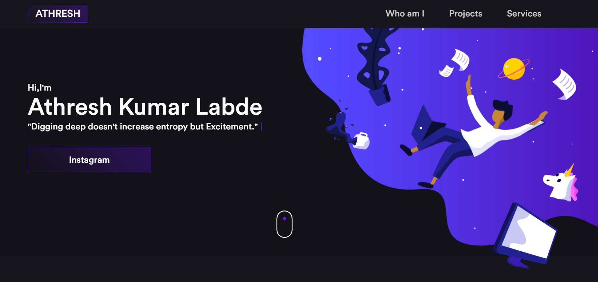

<h1 align="center">
  📰 My Portfolio
</h1>

<h4 align="center">
  My Portfolio created in order to showcase my creative mastery.
</h4>

<h4 align="center"><a href="https://iuricode.vercel.app/">Click here for a preview</a></h4>

## 📚 Sections
The website consists of 5 different sections:

- **Home:**  In it we have an avatar of my github and a brief introduction;
- **About:** In this section I have a description saying a little about who I am;
- **Projects:** It presents some developed projects and with direct link to the respective codes on GitHub;
- **Blog:** Displays through cards the different Blog posts I have written;

---

## 💼 Technologies used
For the development of my Portfolio website I used the following technologies:

- HTML;
- Sass;
- JavaScript;

---

## 🦄 Autor 
<table>
  <tr>
    <td align="center">
      <a href="https://github.com/athreshkumar2">
         
        
          <b>Athresh Kumar Labde</b>
        
      </a>
    </td>
  </tr>
</table>
